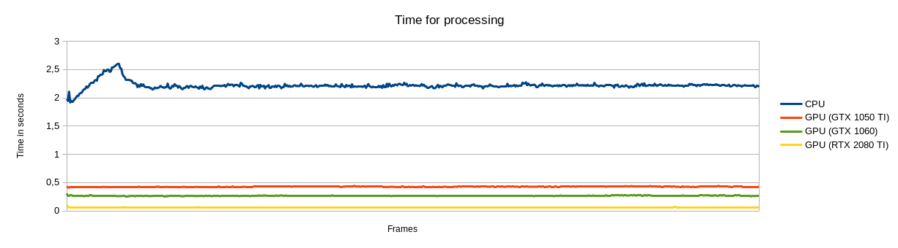

# Python-AI-Server

This server is an implementation of the `Python-Server` using an ai-based approach for the `ImageProcessor`.

The code of the ai was taken from the project [Generative Image Inpainting](https://github.com/JiahuiYu/generative_inpainting).
As this project was not designed to be used as python-package it was easier to copy the code.
Therefore the Licence for this part will differ from the rest of the project.

## How to use

### Prepare

In order to work you need to install a trained model under `model_logs`.
The default path is `model_logs/release_places2_256_deepfill_v2`.
You can fnd some pretrained models [here](https://github.com/JiahuiYu/generative_inpainting#pretrained-models).

### CPU only

To run this server in CPU only mode you have to install all dependencies included in `requirements.txt`.
As this project needs an older version of tensorflow, the latest supportet python version is 3.7.
```bash
# optional
python3.7 -m venv venv
source venv/bin/activate

python3.7 -m pip install -r requirements.txt 
```

Then you can start the server by calling:
```bash
python3.7 src/main.py
```

This will start a new server on port 4444.
As this version is very slow it is not recommended.

### GPU (Docker)

To use the GPU for processing in order to speedup the process you could use the provided docker version.
The GPU-version was realized using docker as tensorflow 1.15 is used which relies on an older version of cuda.
For that reason it was easier to warp everything inside a docker container to ensure the right version of cuda is used.

To run this version you have to set up `docker` and `nvidia-container-runtime` on your system.

Then you could build the container e.g. by running: 
```bash
docker build -t python-ai-server:latest  ./
```

While building the container a file of the dependency `neuralgym` will be replaced with a patch as the original version relies on the output of `nvidia-smi` which differs inside the container.

This version needs a second script outside the container to enable the preview.
To use it you have to install `opencv-contrib-python`

To start the server 1execute the script `run-with-gpu.sh`.
This will start the server on port 4444.
The recorded videos and photos will be saved under `/tmp/out`.
For the preview a socket file under `/tmp/image.sock` gets created.

If something fails make sure the container will be stopped, and the socket file gets removed to prevent crashes while the next run.

Keep in mind that this still requires a very good GPU to achieve "realtime" results.
The following graph shows the comparison between some GPUs:

